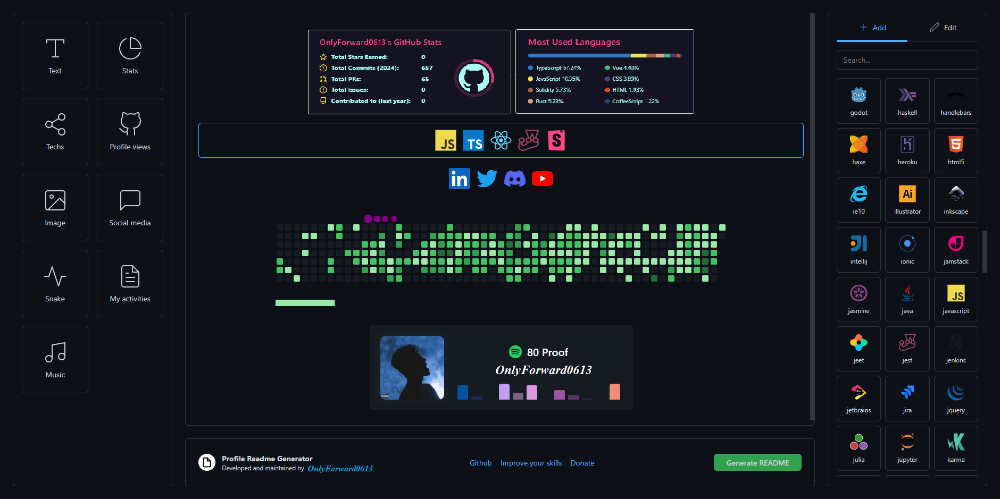

<h1 align="center">🖐️ Senior Software Engineer 🖐️</h1> 
 

<table align="center">
<tr>
    <td align="center" width="90">
      
       Nest.js
    </td>
    <td align="center" width="90">
      
       DeFi
    </td>
    <td align="center" width="90">
      
       Rust
    </td>
    <td align="center" width="90">
      
       Anchor
    </td>
    <td align="center" width="90">
      
       Foundry
    </td>
    <td align="center" width="90">
      
       HardHat
    </td>
    <td align="center" width="90">
      
       Rails
    </td>
  </tr>
  <tr>
    <td align="center" width="90">
      
       React
    </td>
    <td align="center" width="90">
      
       Next.js
    </td>
    <td align="center" width="90">
      
       Node.js
    </td>
    <td align="center" width="90">
      
       WordPress
    </td>
    <td align="center" width="90">
      
       Typescript
    </td>
    <td align="center" width="90">
      
       PHP
    </td>
    <td align="center" width="90">
      
       Express
    </td>
    <td align="center" width="90">
      
       Vue
    </td>
    <td align="center" width="90">
      
       Nuxt.js
    </td>
    <td align="center" width="90">
      
       Angular
    </td>
    <td align="center" width="90">
      
       Tailwind
    </td>
    <td align="center" width="90">
        
       GraphQL
    </td>
    <td align="center" width="90">
      
       Three.js
    </td>
    <td align="center" width="90">
      
       Android
    </td>
  </tr>
  <tr>
    <td align="center" width="90">
      
       Ruby
    </td>
    <td align="center" width="90">
      
       GoLang
    </td>
    <td align="center" width="90">
      
       Express
    </td>
    <td align="center" width="90">
      
       Nest.js
    </td>
    <td align="center" width="90">
      
       Django
    </td>
    <td align="center" width="90">
      
       Laravel
    </td>
    <td align="center" width="90">
      
       Flutter
    </td>
    <td align="center" width="90">
      
       MongoDB
    </td>
   
  </tr>
</table>
 

  

  
  
  

 
